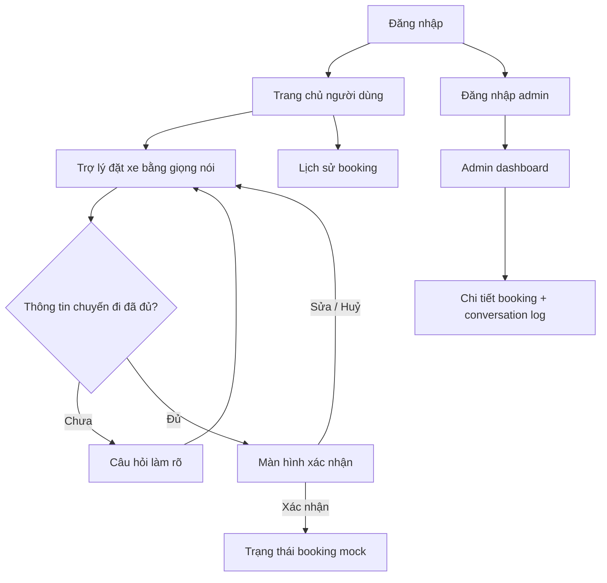

# V-VoiceRide Wireframe / UI Flow

## Sơ Đồ Màn Hình



## 1. Đăng Nhập

```text
+--------------------------------+
| V-VoiceRide                    |
| Trợ lý đặt xe bằng giọng nói   |
|                                |
| Số điện thoại / Email          |
| [________________________]     |
| Mật khẩu                       |
| [________________________]     |
|                                |
| [ Đăng nhập ]                  |
| [ Vào demo với vai trò user ]  |
+--------------------------------+
```

## 2. Trang Chủ Người Dùng

```text
+--------------------------------+
| Xin chào, Demo User            |
|                                |
| [ Đặt xe bằng giọng nói ]      |
| [ Lịch sử booking ]            |
|                                |
| Chuyến gần đây                 |
| VinUni -> Bạch Mai             |
+--------------------------------+
```

## 3. Trợ Lý Đặt Xe Bằng Giọng Nói

```text
+--------------------------------+
| Đặt xe                         |
|                                |
| Trợ lý: Hôm nay bạn muốn đi    |
| từ đâu đến đâu?                |
|                                |
| Transcript                     |
| "Đặt xe từ VinUni đến..."      |
|                                |
| Draft chuyến đi                |
| Điểm đón: VinUni               |
| Điểm đến: Bạch Mai             |
| Loại xe: Chưa có               |
|                                |
| [ Giữ để nói ] [ Nhập text ]   |
+--------------------------------+
```

## 4. Hỏi Làm Rõ

```text
+--------------------------------+
| Cần thêm một thông tin          |
|                                |
| Trợ lý: Bạn muốn đi xe máy     |
| hay ô tô?                      |
|                                |
| [ Xe máy ] [ Ô tô ]            |
| [ Trả lời bằng giọng nói ]     |
+--------------------------------+
```

## 5. Xác Nhận Chuyến Đi

```text
+--------------------------------+
| Xác nhận chuyến đi             |
|                                |
| Điểm đón: VinUni               |
| Điểm đến: Bệnh viện Bạch Mai   |
| Loại xe: Ô tô                  |
|                                |
| Trợ lý đọc lại thông tin       |
| trước khi tạo booking.         |
|                                |
| [ Xác nhận đặt xe ]            |
| [ Sửa thông tin ] [ Huỷ ]      |
+--------------------------------+
```

## 6. Trạng Thái Booking Mock

```text
+--------------------------------+
| Đã tạo booking                 |
|                                |
| Mã: VR-000123                  |
| Trạng thái: Đã gán tài xế mock |
| ETA: 5 phút                    |
|                                |
| [ Về trang chủ ]               |
+--------------------------------+
```

## 7. Admin Dashboard

```text
+------------------------------------------------+
| Admin Dashboard                                |
| Bộ lọc: [Ngày] [Trạng thái] [Loại xe]          |
|                                                |
| ID       Tuyến đường             Trạng thái    |
| VR-123   VinUni -> Bạch Mai      Confirmed     |
| VR-124   Nhà -> Chợ              Clarifying    |
|                                                |
| Panel chi tiết: transcript, slot đã trích      |
| xuất, kết quả xác nhận và lỗi nếu có.          |
+------------------------------------------------+
```
